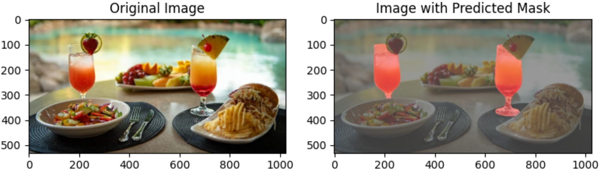
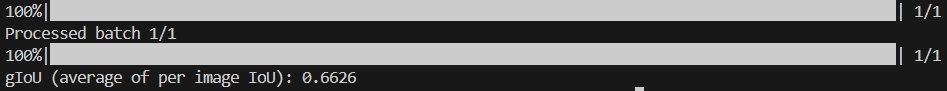

# Seg-Zero: Reasoning-Chain Guided  Segmentation via Cognitive Reinforcement

The repo is the official implement of **"[Seg-Zero: Reasoning-Chain Guided  Segmentation via Cognitive Reinforcement](https://arxiv.org/abs/2503.06520)"**.   
The repo is also the official training code of **"[VisionReasoner: Unified Visual Perception and Reasoning via Reinforcement Learning](https://arxiv.org/pdf/2505.12081)"**.  

Paper: [📖 Seg-Zero](https://arxiv.org/pdf/2503.06520)  [📖 VisionReasoner](https://arxiv.org/pdf/2505.12081)    
HuggingFace Daily: [🤗 Seg-Zero](https://huggingface.co/papers/2503.06520)  
Data: [🤗 RefCOCOg-9K](https://huggingface.co/datasets/Ricky06662/refCOCOg_9k_840) 
[🤗 VisionReasoner-MultiObjects-7K](https://huggingface.co/datasets/Ricky06662/VisionReasoner_multi_object_7k_840)  
Model: [🤗 Seg-Zero-7B](https://huggingface.co/Ricky06662/Seg-Zero-7B)  [🤗 VisionReasoner-7B](https://huggingface.co/Ricky06662/VisionReasoner-7B)   
Relative Link: [VisionReasoner![[code]](https://img.shields.io/github/stars/dvlab-research/VisionReasoner)](https://github.com/dvlab-research/VisionReasoner)     

Overview of Seg-Zero:

<div align=center>

</div>

Seg-Zero demonstrates following features:
1. Seg-Zero exhibits emergent test-time reasoning ability. It generates a reasoning chain before producing the final segmentation mask. 
2. Seg-Zero is trained exclusively using reinforcement learning, without any explicit supervised reasoning data.
3. Compared to supervised fine-tuning, our Seg-Zero achieves superior performance on both in-domain and out-of-domain data.

**Highlight Code Features**:
1. This code is based on the [EasyR1](https://github.com/hiyouga/EasyR1) and [veRL](https://github.com/volcengine/verl), which supports model split during sampling and is more GPU memory friendly.
2. Supporting both Qwen2-VL and Qwen2.5-VL series models.
3. Already implementing commonly used rewards in Object Detection and Object Segmentation, including IoU reward and L1 reward. 


## News

[May 17th, 2025] 🔥 We release [VisionReasoner](https://github.com/dvlab-research/VisionReasoner)! VisionReasoner supports multi-objects and multi-tasks.  
[March 11th, 2025] 🔥 [Paper](https://arxiv.org/abs/2503.06520) is coming!   
[March 8th, 2025] 🔥 Seg-Zero is coming! We have released the code and training data.

## !!! Attention !!!
> [!TIP]
> This operation is risky, please make sure you have backed up the code if you make any changes.  

We made a major update in May. We now support multi-object segmentation. If you'd like to use the previous single-object segmentation, please use the following command to revert to the old version.  
```bash
git reset --hard 77f9ea5887ec7e6abf398ed3cb483c65631c82b7
```

## Contents
- [Model](#model)
- [Examples](#examples)
- [Installation](#installation)
- [Inference](#inference)
- [Evaluation](#evaluation)
- [Training](#training)
- [Build Your Data](#build-your-own-training-data-optional)
- [Citation](#citation)
- [Acknowledgement](#acknowledgement)


## Model
<div align=center>

</div>

Seg-Zero employs a decoupled architecture, including a reasoning model and segmentation model. We manually design a sophiscated reward mechanism that integrates both the format and accuracy rewards.


## Examples

<div align=center>

</div>


## Installation

```bash
git clone https://github.com/dvlab-research/Seg-Zero.git
cd Seg-Zero
conda create -n visionreasoner python=3.12
conda activate visionreasoner
pip install torch==2.6.0 torchvision==0.21.0
pip install -e .
```


## Inference
Download pretrained models using the following scripts:
```bash
mkdir pretrained_models
cd pretrained_models
git lfs install
git clone https://huggingface.co/Ricky06662/VisionReasoner-7B
```

> [!TIP]
> If you encounter issues with connecting to Hugging Face, consider using `export HF_ENDPOINT=https://hf-mirror.com`.

Then run inference using: 
```bash
python inference_scripts/infer_multi_object.py
```
The default question is 
> "What can I have if I'm thirsty?"

You will get the thinking process in command line, like:

> "The question asks for items that can be consumed if one is thirsty. In the image, there are two glasses that appear to contain beverages, which are the most likely candidates for something to drink. The other items, such as the salad, fruit platter, and sandwich, are not drinks and are not suitable for quenching thirst."

And the mask will be presented in **inference_scripts** folder. 

<div align=center>

</div>

You can also provide your own image_path and text by:
```bash
python inference_scripts/infer_multi_object.py --image_path "your_image_path" --text "your question text"
```

## Evaluation  

Evaluation Data: [🤗 ReasonSeg-Test](https://huggingface.co/datasets/Ricky06662/ReasonSeg_test)  [🤗 ReasonSeg-Val](https://huggingface.co/datasets/Ricky06662/ReasonSeg_val)   

```bash
bash evaluation_scripts/eval_reasonseg_visionreasoner.sh
```  
Adjusting '--batch_size' in the bash scripts based on your GPU. And you will see the gIoU in your command line.  
<div align=center>

</div> 

> [!NOTE]
> Results in VisionReasoner are evaluated within one checkpoint.  We recommand you to [VisionReasoner](https://github.com/dvlab-research/VisionReasoner) for evaluation on more tasks and more benchmarks.

> [!NOTE]
> However, in Seg-Zero, the best results on different benchmark are evaluated using different checkpoint. We just evaluate all available checkpoints and write down their value.  For someone who may care about the performance, we suggest you can evaluate all benchmark within one model and compare the value (of our released checkpoint) in your environment.

## Training

### 1. GRPO Training  

> [!NOTE]
> The recommanded training requirement for 7B model is a 4x80G GPUs server or a 8x46G GPUs server.   

Training Data: [🤗 MultiObject-1K](https://huggingface.co/datasets/Ricky06662/VisionReasoner_multi_object_1k_840)  [🤗 MultiObject-7K](https://huggingface.co/datasets/Ricky06662/VisionReasoner_multi_object_7k_840)   
Download dataset using this script: 
```bash
python training_scripts/download_dataset.py
```

> [!TIP]
> Try resize the image and re-calculate the corresponding bbox/point coordinates if you have lower GPU memory. Remeber changing the corresponding resize_size in evaluation and inference.    

Download pretrained models using the following scripts:
```bash
mkdir pretrained_models
cd pretrained_models
git lfs install
git clone https://huggingface.co/Qwen/Qwen2.5-VL-7B-Instruct
```

Start training using this script:
```bash
bash training_scripts/run_visionreasoner_7b_4x80G.sh
```  
(Optional) Or you can use: 
```bash
bash training_scripts/run_visionreasoner_7b_8x46G.sh
```

You can try change the following hyper-parameters if you have a large GPU memory.
```bash
worker.actor.micro_batch_size_per_device_for_update=1 or 2 or 4 or 8 or 16 \
worker.actor.micro_batch_size_per_device_for_experience=1 or2 or 4 or 8 or 16 \
```
If your GPU has less memory, you can change the following config. The number is depend on your GPU memory.
```bash
worker.rollout.tensor_parallel_size=[your number between 1-4]
worker.rollout.gpu_memory_utilization=[your number between 0-1]
worker.rollout.n=[your number between 2-32]
```

(Optional) If you have 8x140G GPUs, you can try: 
```bash
bash training_scripts/run_visionreasoner_7b.sh
```

### 2. Merge Checkpoint in Hugging Face Format

```bash
python3 training_scripts/model_merger.py --local_dir [path_to_your_actor_checkpoint]
```


## Build Your Own Training Data (Optional)
Please refer to our training data preparation [toturial](prepare_dataset/training_data_prepare_toturial.ipynb).

## The GRPO Algorithm

<div align=center>

</div>

Seg-Zero generates several samples, calculates the rewards and then optimizes towards samples that achieve higher rewards.

> [!TIP]
> To learn more about the GRPO algorithm, you can refer to [Hugging Face's blog](https://huggingface.co/docs/trl/v0.15.2/en/grpo_trainer).


## Citation

```bibtex
@article{liu2025segzero,
  title        = {Seg-Zero: Reasoning-Chain Guided  Segmentation via Cognitive Reinforcement},
  author       = {Liu, Yuqi and Peng, Bohao and Zhong, Zhisheng and Yue, Zihao and Lu, Fanbin and Yu, Bei and Jia, Jiaya},
  journal      = {arXiv preprint arXiv:2503.06520},
  year         = {2025}
}

@article{liu2025visionreasoner,
  title        = {VisionReasoner: Unified Visual Perception and Reasoning via Reinforcement Learning},
  author       = {Liu, Yuqi and Qu, Tianyuan and Zhong, Zhisheng and Peng, Bohao and Liu, Shu and Yu, Bei and Jia, Jiaya},
  journal = {arXiv preprint arXiv:2505.12081},
  year         = {2025}
}
```

## Acknowledgement
We would like to thank the following repos for their great work: 

- This work is built upon the [EasyR1](https://github.com/hiyouga/EasyR1) and [veRL](https://github.com/volcengine/verl).
- This work utilizes models from  [Qwen2-VL](https://huggingface.co/Qwen/Qwen2-VL-2B-Instruct), [Qwen2.5-VL](https://huggingface.co/Qwen/Qwen2.5-VL-3B-Instruct) and [SAM2](https://huggingface.co/facebook/sam2-hiera-large). 


## Star History

[](https://star-history.com/#dvlab-research/Seg-Zero&Date)